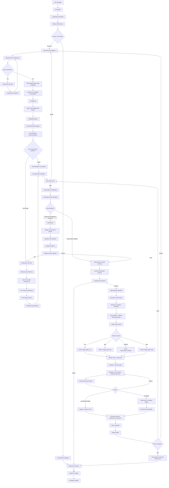

# Image Agent 生产级落地实施 Spec

更新时间：2026-07-07

本文档整合 5 个模块 agent 的圆桌结论，目标是把 Image Agent 从“能跑的 Agent 原型”推进为“可审计、可恢复、可扩展、可生产部署的脑影像处理 Agent 系统”。原则是：能采用成熟开源组件就采用成熟开源组件，不从 0 重造基础设施；核心能力必须围绕真实生产场景设计，而不是 demo。

## 0. 圆桌结论

5 个 agent 的分工与共识如下：

| 模块 | 关注点 | 核心结论 |
|---|---|---|
| Agent 1：上下文、状态、checkpoint、provenance | 上下文如何管理，业务事实如何落库 | LangGraph checkpoint 只负责图恢复；业务事实、执行状态、授权、产物、评估必须落到独立业务表 |
| Agent 2：意图识别、LangGraph、运行策略 | 两级意图识别、规则和 LLM 如何协同 | 一级只分 Answer / Tool Task；二级再分子类型；采用规则优先 + 上下文 grounding + 结构化 LLM + 置信度门控 |
| Agent 3：RAG / 知识图谱 / 软件目录 | 用 RAG 还是知识图谱 | 不二选一，采用 Registry-first + Elasticsearch Hybrid RAG + KG；Registry 是生产事实源，RAG 找证据，KG 管关系约束 |
| Agent 4：脑影像软件生态和 workflow registry | 采集哪些软件文档，如何支持所有成熟序列 | 不在核心代码硬编码 T1/BOLD/DWI；通过“标准层 + 工具注册层 + workflow contract 层”覆盖成熟脑影像序列 |
| Agent 5：任务执行系统 | Celery/Redis、容器、状态机、重试、备份 | DB 是真相源，Celery/Redis 是投递层，容器是执行边界，artifact manifest 是复现边界 |

系统最终采用：

```text
FastAPI API
  -> Context Service
  -> LangGraph Main Router
  -> Intent Router
  -> Answer/RAG Subgraph 或 Tool Task Planning Subgraph
  -> Registry / RAG / KG
  -> ExecutionPlan
  -> Policy Gate + Human Authorization
  -> Celery/Redis Execution Control Plane
  -> Docker/Apptainer Worker
  -> Artifact / Provenance / Evaluation
```

## 1. 总体架构原则

### 1.1 生产系统的 6 条底线

1. 所有长任务必须有显式状态机、心跳、取消、重试、超时、清理和 DLQ。
2. 所有执行必须生成 `ExecutionPlan`，不能让 LLM 直接拼命令执行。
3. 所有生产 workflow 必须来自 registry 中已登记的软件版本、镜像、参数、输入输出 contract。
4. 所有产物必须生成 manifest，记录 URI、sha256、size、producer、attempt、container digest、software version。
5. 所有 Agent 关键决策必须写 Agent Run Ledger，包括意图识别、检索证据、workflow 推荐、授权、失败修复建议。
6. 所有医学相关输出必须保持非诊断边界：可以做处理、QC、报告解释、研究辅助建议，不能自动给临床诊断结论。

### 1.2 关键开源组件选择

| 能力 | 推荐工具 | 为什么使用 |
|---|---|---|
| Agent 编排 | LangGraph | 状态图、子图、checkpoint、human-in-the-loop interrupt/resume 适合长流程 Agent |
| API | FastAPI + Pydantic | Python 生态成熟，结构化 schema 方便验证 `ExecutionPlan` 和 `IntentDecision` |
| 任务队列 | Celery + Redis/Valkey | 单机私有化部署简单，支持多队列、worker、超时、重试；业务状态仍由 DB 接管 |
| 生产数据库 | PostgreSQL | 支持并发写、行锁、JSONB、审计查询、`SKIP LOCKED`，比 SQLite 更适合生产控制面 |
| 开发数据库 | SQLite | 仅用于本地开发和测试，不能作为生产执行状态源 |
| 检索 | Elasticsearch | 同时支持 BM25、dense vector、metadata filter、RRF，适合工具文档和错误经验检索 |
| 知识图谱 | Kuzu 或 Neo4j | Kuzu 适合单机嵌入式部署，Neo4j 适合复杂关系和可视化；先 Kuzu，后 Neo4j 可选 |
| 文档 ingestion | LlamaIndex | 可复用 chunking、metadata enrichment、retriever 编排能力 |
| 容器执行 | Docker SDK + Apptainer | Docker 适合单机控制，Apptainer 适合神经影像/HPC 生态 |
| 脑影像标准 | BIDS、BIDS Validator、PyBIDS | 统一数据入口、验证、索引和 derivatives 组织 |
| DICOM 转换 | dcm2niix、HeuDiConv、BIDScoin | 成熟处理 DICOM 到 NIfTI/BIDS，不自研转换器 |
| 通用影像 IO | NiBabel、pydicom、SimpleITK | 覆盖 NIfTI、DICOM、医学图像读写和 header 检查 |
| 工作流生态 | Nipype、NiPreps、Boutiques | 复用成熟 neuroimaging workflow 描述和接口生态 |
| 产物版本 | DataLad/git-annex 或本地 content-addressed FS | 支持可复现数据版本和大文件管理 |
| 观测 | OpenTelemetry + Prometheus + Grafana | 关联 API、Graph、Celery、容器执行，支撑生产排障 |
| Provenance | W3C PROV 模型 + Python prov | 用 Entity / Activity / Agent / Relation 表达产物谱系 |

参考来源：

- LangGraph persistence/checkpointer/store: https://langchain-ai.github.io/langgraph/concepts/time-travel/
- LangGraph checkpointer: https://reference.langchain.com/python/langgraph/types/Checkpointer
- BIDS Apps execution spec: https://bids-standard.github.io/execution-spec/index.html
- BIDS Validator: https://bids-standard.github.io/bids-validator/
- Celery routing: https://docs.celeryq.dev/en/stable/userguide/routing.html
- Celery broker/backend: https://docs.celeryq.dev/en/latest/getting-started/backends-and-brokers/index.html
- Elasticsearch RRF: https://www.elastic.co/docs/reference/elasticsearch/rest-apis/reciprocal-rank-fusion
- fMRIPrep docs: https://fmriprep.org/en/latest/
- MRIQC docs: https://mriqc.readthedocs.io/en/stable/

## 2. 上下文与状态管理

### 2.1 分层存储

| 上下文 | 存放位置 | 内容 |
|---|---|---|
| Graph Runtime Context | LangGraph checkpoint | 当前 node、messages 摘要、pending interrupt、tool refs、checkpoint id |
| Run Business Context | PostgreSQL app_core | project、run、dataset、workflow、状态、参数、错误、重试 |
| Retrieval Context | Elasticsearch + manifest | 软件文档、SOP、错误经验、历史 run 摘要 |
| Artifact Context | 文件系统/DataLad/S3 + PostgreSQL | artifact URI、sha256、size、BIDS entity、版本 |
| Authorization Context | PostgreSQL append-only ledger | scope、TTL、确认记录、拒绝记录、策略快照 |
| Evaluation Context | PostgreSQL + artifact | QC、指标、人工验收、benchmark、回归结果 |

### 2.2 Context Pack

每次进入 LangGraph 前由 Context Service 组装 Context Pack，避免 graph node 到处散查数据库。

```json
{
  "project_id": "...",
  "run_id": "...",
  "thread_id": "...",
  "checkpoint_id": "...",
  "dataset_snapshot": {
    "bids_root_uri": "...",
    "input_manifest_sha256": "...",
    "datalad_commit": "..."
  },
  "policy_snapshot_id": "...",
  "tool_registry_version": "...",
  "rag_context_refs": ["chunk_id"],
  "artifact_refs": ["artifact_version_id"],
  "trace_id": "..."
}
```

### 2.3 Checkpoint 边界

LangGraph checkpoint 保存“图恢复所需的最小状态”，包括当前节点、消息摘要、中断位置、工具调用引用。它不是业务真相源，不保存 NIfTI、DICOM、日志全文、容器输出、RAG 文档全文。

业务真相源是 PostgreSQL：

- `agent_runs`
- `agent_run_events`
- `agent_decisions`
- `execution_runs`
- `execution_attempts`
- `execution_events`
- `authorization_decisions`
- `artifacts`
- `artifact_versions`
- `provenance_activities`
- `provenance_edges`
- `evaluation_runs`
- `evaluation_metrics`

## 3. 意图识别模块

### 3.1 一级意图

用户已确定：一级只分两类。

```text
Answer
Tool Task
```

`observe_repair`、`project_data_management`、`system_help`、`blocked_or_unsafe` 不作为一级分类，而是二级分类或运行态决策。

### 3.2 二级分类

Answer 二级：

```text
project_status_answer
rag_knowledge_answer
result_explanation
system_help
non_diagnostic_boundary
```

Tool Task 二级：

```text
fixed_workflow_request
data_preparation_task
observe_repair_task
exploratory_tool_request
artifact_generation_task
blocked_or_unsafe_task
```

### 3.3 意图识别流水线

```text
InputNormalizer
  -> ContextGrounder
  -> RuleRouter
  -> StructuredIntentLLM
  -> ConfidenceGate
  -> RuntimePolicyBinder
  -> LangGraph Router
```

为什么这样做：

- 规则优先：删除、覆盖、诊断边界、出项目路径、未验证工具真实执行等风险不能交给概率模型。
- ContextGrounder 在 LLM 前：很多中文请求有指代，如“帮我跑一下这个”“结果怎么样”，必须先知道当前项目、影像、任务和历史结果。
- 结构化 LLM：输出 Pydantic schema，可测试、可回放、可做混淆矩阵。
- ConfidenceGate：置信度、风险、缺槽、冲突统一门控，不让模型高置信绕过安全规则。

### 3.4 IntentDecision Schema

```python
class IntentDecision(BaseModel):
    primary: Literal["Answer", "Tool Task"]
    subtype: str
    confidence: float
    risk_level: Literal["low", "medium", "high", "critical"]
    grounding_refs: list[str]
    missing_slots: list[str]
    required_authorization: list[str]
    clarification_question: str | None
    policy_snapshot_id: str
    rationale_codes: list[str]
```

### 3.5 默认阈值

| 条件 | 行为 |
|---|---|
| `confidence >= 0.85` 且低风险 | 直接路由 |
| `0.60 <= confidence < 0.85` | 推荐路径并澄清或确认 |
| `confidence < 0.60` | 必须澄清 |
| critical risk | 必须拒绝或授权，不能靠高置信度绕过 |

### 3.6 循环与熔断

默认策略：

```text
max_clarification_rounds = 3
max_tool_calls_per_intent_run = 6
max_registry_queries = 3
max_rag_queries = 3
max_project_context_reads = 2
same_tool_same_args_failure_limit = 2
same_error_signature_limit = 2
```

## 4. RAG、知识图谱与软件 Registry

### 4.1 三层知识架构

```text
Software Registry: 生产事实源
Elasticsearch Hybrid RAG: 文档证据检索
KG: 关系、约束、兼容性、依赖和修复路径
```

不要只用向量 RAG。脑影像场景大量 query 是软件名、参数名、错误字符串、版本号、BIDS entity、路径，BM25 和结构化过滤非常重要。也不要只用 KG，因为官方文档、release note、GitHub issue、错误经验是长文本和长尾知识。

### 4.2 检索流程

```text
用户问题
  -> 意图识别
  -> 实体链接
  -> KG 约束扩展
  -> Elasticsearch BM25 + dense vector + metadata filter
  -> RRF 融合
  -> graph/path rerank
  -> evidence pack
  -> 回答或 workflow 推荐
```

### 4.3 为什么使用这些算法

| 算法 | 用途 | 原因 |
|---|---|---|
| BM25 | 精确关键词检索 | 适合 CLI 参数、错误日志、软件名、版本号 |
| Dense Vector | 语义召回 | 适合自然语言需求，如“结构像预处理” |
| Metadata Filter | 过滤软件、版本、模态、文档类型 | 降低幻觉，保证回答对齐当前工具版本 |
| RRF | 融合 BM25 和 dense 结果 | 不需要复杂调参，适合混合检索结果融合 |
| Entity Linking | 识别软件、参数、序列、workflow | 让检索进入 KG 和 registry |
| Graph Expansion | 扩展软件版本、参数、错误、修复方案 | 让回答具备结构化约束 |
| Rerank | 对 top-k 结果二次排序 | 结合官方来源权重、版本匹配、人工审核状态 |

### 4.4 Registry Schema

```yaml
software_id: fmriprep
name: fMRIPrep
category: preprocessing
supported_sequences: ["structural_mri", "bold_fmri", "fieldmap"]
maturity: production
license: BSD-3-Clause
homepage: https://fmriprep.org
docs:
  - type: official
    url: https://fmriprep.org/en/latest/
versions:
  - version: "25.1.0"
    containers:
      - image: nipreps/fmriprep:25.1.0
        digest: sha256:...
    requires:
      bids: true
      license_files: ["freesurfer_license"]
    commands:
      - name: fmriprep
        inputs: ["bids_dir", "output_dir", "analysis_level"]
        outputs: ["derivatives/fmriprep"]
        qc: ["html_report", "confounds", "registration_figures"]
        citations: ["boilerplate", "doi"]
review:
  source_verified_at: "2026-07-07"
  review_status: reviewed
```

### 4.5 KG 最小实体

```text
Software
SoftwareVersion
ContainerImage
Command
Parameter
InputArtifact
OutputArtifact
Workflow
WorkflowStep
QCRule
ErrorSignature
Fix
Citation
Dependency
License
SequenceFamily
```

关系示例：

```text
Software -HAS_VERSION-> SoftwareVersion
SoftwareVersion -PACKAGED_AS-> ContainerImage
SoftwareVersion -EXPOSES_COMMAND-> Command
Command -HAS_PARAMETER-> Parameter
Command -CONSUMES-> InputArtifact
Command -PRODUCES-> OutputArtifact
Workflow -HAS_STEP-> WorkflowStep
WorkflowStep -USES_COMMAND-> Command
ErrorSignature -OBSERVED_IN-> SoftwareVersion
ErrorSignature -FIXED_BY-> Fix
Software -CITED_BY-> Citation
```

## 5. 脑影像软件文档采集计划

### 5.1 采集原则

每个软件至少采集：

- 官方主页
- 官方文档
- GitHub 仓库和 release
- Docker/Apptainer 镜像
- CLI help
- paper / DOI / citation boilerplate
- license
- 输入输出样例
- BIDS App contract
- 已知错误和修复策略
- QC 输出和报告格式

所有采集内容都进入：

```text
raw_doc_store
  -> chunk manifest
  -> Elasticsearch index
  -> entity extraction
  -> KG
  -> reviewed Software Registry
```

### 5.2 第一阶段必采集对象

| 类别 | 软件或标准 |
|---|---|
| 标准 | BIDS Specification、BIDS Derivatives、BIDS Apps execution spec、BIDS Validator、NIfTI、DICOM |
| DICOM-to-BIDS | dcm2niix、HeuDiConv、BIDScoin、dcm2bids、ezBIDS |
| 工作流接口 | Nipype、Boutiques、Neurodocker、Docker、Apptainer、Neurodesk |
| 通用 MRI | FreeSurfer、FastSurfer、FSL、ANTs、AFNI、SPM12、SimpleITK、3D Slicer、ITK-SNAP |
| NiPreps | fMRIPrep、sMRIPrep、MRIQC、QSIPrep、QSIRecon、ASLPrep、PETPrep、SDCFlows、Nibabies |
| fMRI/BOLD | fMRIPrep、XCP-D、Nilearn、AFNI、FSL FEAT/MELODIC、C-PAC、CONN、tedana |
| DWI/连接组 | QSIPrep、QSIRecon、MRtrix3、DIPY、FSL FDT、eddy/topup、TORTOISE |
| ASL/灌注 | ASL-BIDS、ASLPrep、ExploreASL、FSL BASIL/FABBER |
| PET | PET-BIDS、PETPrep、PETPVC、NiftyPET、PETSurfer |
| SWI/QSM/qMRI | QSMxT、SEPIA、qMRLab、hMRI-toolbox、MEDI/FANSI/STI Suite |
| MRA/CTA/血管 | ANTs、FSL、ITK/SimpleITK、VMTK、MONAI、nnU-Net、血管分割模型 |
| 放射组学/AI | PyRadiomics、MONAI、nnU-Net、BraTS 工具链、IBSI |
| QC/可视化 | MRIQC、fMRIPrep reports、QSIPrep reports、Nilearn plotting、Niivue |

### 5.3 覆盖目标

目标不是只支持 T1/BOLD/DWI，而是覆盖所有已有成熟处理方法和软件的脑影像序列。实现方式是：

```text
Open Neuroimaging Task Router
  -> Sequence & Metadata Normalization
  -> Capability Matcher
  -> Curated Workflow Registry
  -> Fixed Workflow 或 Exploratory Tool Path
```

核心代码不硬编码序列列表，序列能力来自 registry、BIDS metadata、software catalog 和 workflow contract。

## 6. Workflow Contract

每个固定 workflow 必须有 contract，兼容 BIDS App 和 Boutiques 的思想。

```yaml
id: fmriprep.bold.preproc
name: fMRIPrep BOLD preprocessing
version: "25.1.0"
sequence_scope: ["bold_fmri", "structural_mri", "fieldmap"]
maturity: production
container:
  image: nipreps/fmriprep:25.1.0
  digest: sha256:...
entrypoint: "fmriprep [bids_dir] [out_dir] participant"
inputs:
  datasets:
    - type: bids_raw
      required_suffix: ["T1w", "bold"]
      optional_suffix: ["T2w", "FLAIR", "fieldmap", "sbref"]
  parameters:
    - participant_label
    - output_spaces
    - fs_license_file
outputs:
  derivatives_root: derivatives/fmriprep
  files:
    - preproc_bold
    - brain_mask
    - confounds_timeseries
    - transforms
    - html_report
qc:
  metrics: ["fd_mean", "tSNR", "registration_score"]
  report: "sub-*.html"
runtime:
  cpu_min: 8
  mem_gb_min: 16
  gpu: false
  network: disabled
provenance:
  command: required
  software_versions: required
  input_hashes: required
  output_manifest: required
```

Contract 规则：

- 输入必须声明 raw BIDS、derivatives、DICOM、NIfTI、mask、atlas、metadata。
- 输出必须落入 BIDS derivatives 或可映射 derivatives。
- 每次运行必须生成 `command.txt`、`environment.json`、`manifest.json`、`qc.json`、`citations.bib/md`。
- 容器必须 pin tag + digest。
- 默认禁网、只读输入、独立 workdir、独立 output。

## 7. 执行系统

### 7.1 组件

```text
api-server
planner
execution-db
dispatcher
worker
reconciler
artifact-manager
eval-runner
```

### 7.2 状态机

```text
CREATED
  -> PLANNED
  -> WAITING_AUTHORIZATION
  -> QUEUED
  -> LEASED
  -> PREPARING
  -> RUNNING
  -> FINALIZING
  -> SUCCEEDED
```

异常分支：

```text
CANCEL_REQUESTED -> CANCELLING -> CANCELLED
RUNNING -> TIMED_OUT -> CLEANUP_PENDING -> RETRYABLE_FAILED -> QUEUED
RUNNING -> FAILED_TERMINAL -> DLQ
```

### 7.3 Celery/Redis 使用方式

Celery task 不代表业务状态，只负责唤醒 worker。worker 领取 DB lease 后执行容器，并把状态写回 PostgreSQL。

队列：

```text
image_agent_cpu
image_agent_gpu
image_agent_sandbox
image_agent_long
image_agent_io
```

原因：

- Redis 抖动或 worker 重启时，DB 仍然知道任务真实状态。
- Celery 重复投递不会导致重复执行，因为 DB lease 和 idempotency key 会阻止非法状态转移。
- 不同资源任务隔离，避免大任务阻塞轻量任务。

### 7.4 幂等与重试

```text
idempotency_key = plan_hash + input_manifest_sha256 + step_name + normalized_params
```

规则：

- retry 必须创建新 attempt，不覆盖旧 attempt。
- attempt 输出先写 temp 目录，成功后原子提交。
- 失败保存最近日志 tail、错误签名、资源快照、容器 digest。
- 同一错误签名连续 2 次停止自动循环。
- 固定成熟 workflow 可支持 one-click safe retry。
- 非固定工具、权限变化、数据范围变化、网络范围变化、镜像变化必须重新授权。

### 7.5 容器安全

默认策略：

- 非 root 运行。
- input 只读挂载。
- output 独立写目录。
- 默认禁网。
- drop capabilities。
- seccomp/AppArmor。
- no-new-privileges。
- 镜像 allowlist + digest pin。
- Docker socket 不挂入任务容器。
- secret 不写日志。
- DICOM/PHI 脱敏前置 gate。

## 8. LangGraph Target Graph



## 9. 100 个落地问题清单

### 9.1 上下文、状态、checkpoint、provenance

1. 目标部署是单用户工作站、实验室服务器，还是医院科室内网服务器？
2. 是否必须完全离线运行，包括 LLM、embedding、文档检索和镜像校验？
3. 是否处理 PHI/PII，如果处理，脱敏和审计标准是什么？
4. 项目级隔离使用目录、数据库 `project_id`、容器 mount namespace，还是三者都要？
5. 输入数据优先支持 DICOM、BIDS，还是两者都作为一等入口？
6. 是否要求自动 DICOM-to-BIDS heuristics，还是由用户提供 mapping？
7. Artifact 存储使用本地 NAS、DataLad/git-annex、S3-compatible，还是混合？
8. 是否要求每个产物都按 sha256 内容寻址？
9. checkpoint、日志、临时目录、产物分别保留多久？
10. 是否要求 run 的精确复现，包括容器 digest、参数、输入 manifest、随机种子？
11. 是否有 SLURM/PBS/LSF 等集群调度器后续接入计划？
12. 是否有 GPU 任务，如深度学习分割、配准、QC 模型？
13. FreeSurfer/FSL/SPM 等许可证如何管理？
14. 用户身份来自本机账户、应用内账户，还是暂时只做单机 operator？
15. `owner/operator/viewer/service` 简单角色是否需要保留，还是先只做单机 operator？
16. 哪些操作必须人工确认：删除、覆盖、启动长流程、下载敏感产物、跨项目复制？
17. Agent 可以自动执行到什么程度：只建议命令，还是可直接排队执行容器？
18. RAG 知识库是否包含软件文档、SOP、历史 run、论文方法、报错知识库？
19. QC 标准由系统默认、项目模板，还是每个 workflow 自定义？
20. 失败重试策略按错误类别自动选择，还是先统一人工确认？

### 9.2 意图识别、LangGraph、运行策略

21. Answer 的 5 个二级类别名称是否固定使用当前命名？
22. Tool Task 的 6 个二级类别名称是否固定使用当前命名？
23. 系统输出是否严格禁止临床诊断结论？
24. 目标用户主要是医生、科研人员、技师，还是混合用户？
25. 是否允许联网 LLM，还是必须本地模型？
26. 支持哪些输入格式：DICOM、NIfTI、BIDS、NRRD、MHA？
27. 自动匿名化是必选步骤还是用户可选？
28. 是否需要 PHI/PII 审计导出？
29. 单机权限是否已经确定不做多用户 RBAC？
30. 授权 TTL 按分钟、会话、项目，还是任务绑定？
31. 哪些工具任务必须人工确认？
32. 是否允许覆盖、删除、移动原始影像文件？
33. 是否需要多病例批处理？
34. 是否需要接 PACS/RIS/HIS？
35. 是否需要中文、英文或双语报告？
36. 是否已有固定报告模板？
37. 是否已有分割/检测模型？
38. 是否要求模型版本、prompt 版本、策略版本全部锁定？
39. 失败后是自动重试、降级模型，还是直接人工接管？
40. 审计日志保存多久，是否要导出为报告？

### 9.3 RAG、KG、软件 Registry

41. v1 catalog 先收哪些软件，按使用频率、成熟度还是 workflow 覆盖度排序？
42. 软件版本只收最新稳定版，还是保留历史主版本？
43. 容器 digest 是否强制要求，未锁 digest 的镜像是否允许进入 production？
44. Workflow contract 的最小必填字段是什么？
45. 输入输出 artifact 是否完全采用 BIDS Derivatives 命名体系？
46. 如何表示同一参数在不同版本中的语义变化？
47. 如何区分官方文档、社区经验、内部经验的可信度？
48. GitHub issue/forum 类错误经验是否需要人工审核？
49. CLI help 抓取是否在容器内自动运行？
50. 是否对每个软件版本执行 smoke test？
51. QC 阈值来自官方、论文、经验规则还是项目自定义？
52. Citation 是软件级、版本级、方法级，还是 workflow step 级？
53. query 同时命中多个版本时，默认回答哪个版本？
54. 如何处理商业软件或许可证受限软件？
55. Elasticsearch chunk 粒度按页面、标题层级、命令块还是语义段落？
56. 实体链接如何处理同义词，如 `T1w`、`T1-weighted`、`structural MRI`？
57. 检索结果是否必须返回 provenance 和 source URL？
58. LLM 是否允许生成未在 registry 中登记的 workflow？
59. 如何评测 citation correctness 和 error-fix correctness？
60. 知识更新失败时，是阻断发布，还是保留上一版索引？

### 9.4 脑影像序列与软件处理

61. DICOM 匿名化如何保证不破坏序列识别字段？
62. DICOM series 到 BIDS entity 的映射如何可回放、可审计？
63. 多 vendor/private tag 如何做规则库？
64. BIDS Validator 通过但关键 metadata 缺失时如何分级告警？
65. fieldmap `IntendedFor` 自动推断错误时如何人工修正？
66. ASL control/label/deltaM/cbf 三种输入形态如何统一？
67. PET tracer、frame timing、SUV/SUVR、动态 PET 如何建模？
68. QSM magnitude/phase、echo、part-mag/part-phase 如何自动配对？
69. FLAIR/T2/T1 多结构序列的配准优先级如何定义？
70. DWI bvec 旋转、PE 方向、topup/eddy 条件如何验证？
71. workflow 失败后如何支持断点续跑和缓存复用？
72. 单机生产部署如何限制 CPU/RAM/磁盘临时空间？
73. FreeSurfer license、MATLAB runtime、FSL license 如何管理？
74. 容器镜像如何离线导入、签名、漏洞扫描、版本冻结？
75. QC 阈值如何区分研究项目、临床队列、儿童/老年/病灶人群？
76. derivatives 命名如何避免不同 pipeline 输出互相覆盖？
77. 多 workflow 共享 T1 预处理结果时如何声明依赖和兼容版本？
78. citation 如何从多个工具链自动合并、去重、导出 BibTeX？
79. MRA/CTA/病灶/肿瘤等 AI 模型如何登记训练域和适用边界？
80. 人工复核结果如何写回 registry，形成可学习的序列映射/QC 知识库？

### 9.5 执行系统、容器、运维

81. ExecutionPlan schema 是否需要版本化？
82. DAG step 是否允许动态展开？
83. 任务取消时，容器内子进程如何全部杀干净？
84. lease TTL 和 heartbeat 周期如何配比？
85. Redis/Valkey broker 丢失后，DB 中 `QUEUED` 状态如何重投？
86. worker 崩溃后，半成品 artifact 如何识别和清理？
87. 同一个输入重复提交时，是复用结果还是新建 run？
88. GPU 资源如何表达：型号、显存、CUDA 版本、MIG？
89. 大文件 hash 是同步算还是后台算？
90. artifact manifest 是否需要签名？
91. PHI 脱敏失败是否允许进入后续流程？
92. 容器是否默认禁网，哪些工具确实需要联网？
93. 镜像 digest 变更后，历史 run 如何复现？
94. Celery queue 如何按 CPU/GPU/IO 分类？
95. DLQ 中哪些失败允许 one-click retry？
96. retry 是否允许修改资源配置？
97. 本地磁盘不足时，是拒绝入队还是中途 fail-fast？
98. 日志保留多久，是否跟 artifact 生命周期绑定？
99. SQLite 模式下哪些生产能力明确禁用？
100. 评估集和生产任务是否共用 worker 池？

## 10. 分阶段实施计划

### Phase 1：生产骨架

目标：先把系统从 demo 式调用变成有状态、有审计、有恢复的控制面。

必须完成：

- `ExecutionPlan` schema 版本化。
- PostgreSQL 生产配置，SQLite 仅开发。
- `execution_runs / execution_attempts / execution_events` 完整状态机。
- Celery/Redis 多队列。
- worker lease + heartbeat。
- cancel/timeout/retry/cleanup/DLQ。
- artifact manifest。
- Agent Run Ledger 基础事件。

### Phase 2：意图识别与 LangGraph 重排

目标：把一级二级意图、规则优先、澄清、授权、熔断真正落到 graph。

必须完成：

- `IntentDecision` Pydantic schema。
- RuleRouter 规则集。
- ContextGrounder。
- StructuredIntentLLM。
- ConfidenceGate。
- Clarification interrupt。
- PolicySnapshot。
- Loop budget 和 repeated failure cutoff。

### Phase 3：Registry-first RAG/KG

目标：建立软件事实源，RAG 用于证据，KG 用于约束。

必须完成：

- `software.yaml` 和 `workflow.yaml` schema。
- 首批 10 到 15 个成熟软件 registry。
- Elasticsearch hybrid index。
- BM25 + dense + metadata filter + RRF。
- Kuzu/Neo4j property graph。
- `/software`、`/search`、`/graph/neighbors`、`/workflow/validate` API。

### Phase 4：脑影像 workflow 覆盖

目标：从少量固定流程扩展到成熟序列插件化覆盖。

必须完成：

- DICOM/NIfTI/BIDS intake。
- BIDS Validator + 自定义 metadata rule。
- dcm2niix + HeuDiConv/BIDScoin wrapper。
- fMRIPrep、MRIQC、QSIPrep、ASLPrep、FreeSurfer、ANTs、FSL、MRtrix3 等 contract。
- sequence/task router 从 registry 动态读取能力，不硬编码 T1/BOLD/DWI。

### Phase 5：评估、观测和论文级证据

目标：形成可以写论文和支撑生产交付的指标体系。

必须完成：

- 100 到 150 条中文真实请求评估集。
- 意图识别混淆矩阵。
- RAG Recall@5、MRR、citation correctness、faithfulness。
- workflow 推荐 Top-1/Top-3。
- 工具调用成功率。
- 长任务误触发率。
- repeated failure cutoff 命中率。
- 每个 pipeline 的资源、耗时、失败率、QC 通过率。
- OpenTelemetry trace + Prometheus/Grafana dashboard。

## 11. 可审阅的验收标准

### 11.1 工程指标

| 指标 | 目标 |
|---|---|
| 一级意图 Answer/Tool Task accuracy | >= 95% |
| Answer 二级分类 accuracy | >= 90% |
| Tool Task 二级分类 accuracy | >= 88% |
| 高风险阻断 recall | >= 98% |
| 固定 workflow 推荐 Top-1 | >= 85% |
| 固定 workflow 推荐 Top-3 | >= 95% |
| RAG Recall@5 | >= 85% |
| 工具调用成功率 | >= 90% |
| 真实长任务误触发率 | < 1% |
| 非固定工具真实执行误触发率 | 0% |
| repeated-failure cutoff 成功率 | >= 95% |

### 11.2 生产能力

系统达到以下条件，才算“正式产品”而不是“玩具 demo”：

- 任务可取消、可恢复、可追踪。
- worker 崩溃后能通过 reconciler 收敛状态。
- 所有容器执行有 digest、输入 manifest、输出 manifest。
- 每个 workflow 有 citation 和 QC。
- 所有执行可以复现。
- 所有关键决策有 ledger。
- RAG 回答有来源。
- 固定 workflow 不依赖 LLM 自由发挥。
- 非固定工具必须 sandbox 和人工授权。
- 单机权限简单，但项目级数据隔离明确。

## 12. 下一步建议

优先开发顺序：

1. 先把 `ExecutionPlan` 和执行状态机补齐到生产级。
2. 再实现 `IntentDecision + RuleRouter + ConfidenceGate`。
3. 同步建立 `Software Registry` 的 schema，不急着先大规模采集。
4. 先接 3 个代表性固定 workflow：MRIQC、fMRIPrep、QSIPrep。
5. 再做 RAG/KG ingestion，把 registry、官方文档、CLI help、错误经验打通。

原因：执行控制面是所有工具任务的地基；意图识别决定是否触发任务；registry 决定触发什么任务。三者先闭环，后续扩展脑影像软件和序列才不会越做越乱。
