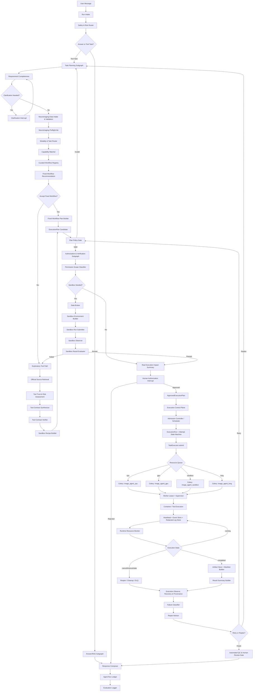

# Image Agent Agentic Workflow Roadmap

> **For agentic workers:** REQUIRED SUB-SKILL: Use superpowers:subagent-driven-development or superpowers:executing-plans before implementing concrete tasks from this roadmap. This document is a staged roadmap, not the final task-by-task implementation checklist.

**Goal:** Upgrade Image Agent into a registry-first, policy-gated, Celery-backed neuroimaging Agent workflow platform.

**Architecture:** The target architecture uses a hierarchical LangGraph design. A deterministic main graph routes user requests into read-only answering or tool-task planning; task planning prioritizes curated fixed workflows, falls back to sandbox-validated exploratory tools, and emits execution plans that pass policy gates before Celery workers run neuroimaging jobs.

**Tech Stack:** LangGraph, FastAPI, Celery, Redis, Docker/Apptainer, RAG, Elasticsearch, React, TanStack Query, BIDS Validator, dcm2niix, neuroimaging workflow containers.

---

## Development Principles

- Prefer mature open-source components before custom implementation. Check official documentation, GitHub, PyPI, npm, and neuroimaging ecosystem tools before building a new module.
- Keep LangGraph responsible for reasoning, routing, human-in-the-loop decisions, and state transitions. Keep Celery workers responsible for long-running execution.
- Treat the database as the source of truth. Redis and Celery are transport/execution infrastructure, not authoritative workflow state.
- Keep all production execution registry- or policy-gated. LLM output can propose plans, but cannot directly create long-running tasks.
- Keep all medical claims non-diagnostic. Result summaries describe workflow outputs, QC evidence, and next processing steps, not clinical interpretation.
- Track details that require deeper design as named follow-up design topics instead of burying decisions inside implementation.

## Target Graph

## Milestone 1: Execution Control Plane and Celery Foundation

**Purpose:** Replace direct long-running FastAPI background execution with a Celery/Redis execution layer while preserving existing fixed-workflow behavior.

**Scope:**
- Define `ExecutionPlan`, `ValidatedExecutionPlan`, and `ApprovedExecutionPlan` contracts.
- Add Celery app configuration and resource-aware queues: `image_agent_cpu`, `image_agent_gpu`, `image_agent_sandbox`, `image_agent_long`.
- Add `TaskExecutor.submit()` as the only backend entry point for asynchronous execution.
- Introduce `ExecutionRun` and `ExecutionAttempt` records, or an equivalent first pass that can later migrate to those names.
- Add event sequence fields for queued, leased, running, heartbeat, completed, failed, timeout, cancelled, cleanup events.
- Route one existing fixed workflow through Celery first, preferably a mock or lightweight T1 path before heavy real processing.

**Adopt before building:**
- Celery official Redis broker patterns.
- Celery task routing, `acks_late`, `task_reject_on_worker_lost`, `worker_prefetch_multiplier=1`, soft/hard time limits.
- Existing app task/result services where possible; wrap them rather than duplicating workflow execution logic.

**Acceptance:**
- A confirmed fixed workflow creates an execution record and enters a Celery queue.
- A worker writes heartbeat and task events to the database.
- API/front-end status reads from database-backed endpoints, not from Redis.
- Existing direct diagnostic route remains available only if explicitly marked diagnostic.

## Milestone 2: Worker Supervisor, Cancel, Timeout, Cleanup

**Purpose:** Make long-running Docker/tool execution auditable and stoppable.

**Scope:**
- Add worker-side lease acquisition before execution.
- Add heartbeat refresh and stale-attempt detection.
- Add cancel intent in the database; workers poll and stop child containers/processes.
- Add timeout enforcement from approved execution budgets.
- Add cleanup states for container stop, temporary directory cleanup, lock cleanup, and cleanup failure.
- Keep full logs outside Redis; store database indexes and redacted tails.

**Adopt before building:**
- Docker SDK for Python or existing safe Docker command wrapper.
- Celery revoke only as a secondary control, not the primary cancellation mechanism.
- Existing redaction helpers already present in the API and frontend.

**Acceptance:**
- Running execution can be cancelled through API.
- Timeout produces a terminal timeout state and cleanup event.
- Cleanup failure is visible as its own state, not hidden behind success.
- Repeated Celery delivery does not create duplicate successful attempts.

## Milestone 3: Result Finalization Contracts

**Purpose:** Standardize outputs across fixed workflows and future temporary toolchains.

**Scope:**
- Strengthen `result_summary` and `artifact_manifest`.
- Include workflow/tool id, attempt id, container image/digest where available, input checksum references, output checksum, content type, preview kind, native QC flag, BIDS derivatives path semantics, and non-diagnostic disclaimer.
- Add finalization states so a tool can succeed while artifact finalization fails visibly.

**Adopt before building:**
- Existing artifact manifest and result contract modules.
- BIDS derivatives conventions and BIDS Apps output conventions.

**Acceptance:**
- Completed Celery task emits result summary and artifact manifest.
- Frontend and Agent can read the same contract for fixed workflows.
- No absolute backend paths are exposed.

## Milestone 4: LangGraph Main Router Refactor

**Purpose:** Convert the current LangGraph runner into a cleaner main router with read-only answer and tool-task paths.

**Scope:**
- Add `RunIntake`, `SafetyRiskRouter`, `AnswerOrTaskRouter`.
- Keep Answer/RAG subgraph read-only and ensure it never emits execution plans.
- Introduce task planning as a separate subgraph that can ask clarification questions.
- Preserve current behavior through compatibility tests before expanding functionality.

**Adopt before building:**
- LangGraph subgraphs.
- LangGraph checkpoint/persistence where it fits current app storage.
- LangGraph human-in-the-loop interrupts for clarification and confirmation.

**Acceptance:**
- Pure questions return answer artifacts only.
- Tool-task requests enter planning and can produce clarification prompts.
- No task can be created without an approved execution plan.

## Milestone 5: Neuroimaging Data Intake and Modality Router

**Purpose:** Make the graph visibly neuroimaging-native rather than generic task automation.

**Scope:**
- Add data intake node for DICOM, NIfTI, BIDS, derivatives, and mixed inputs.
- Add BIDS Validator integration for BIDS datasets.
- Add NIfTI header sanity checks using existing nibabel-based code.
- Add DWI sidecar checks for JSON, bval, bvec, phase encoding, readout time.
- Add modality/task router for T1, BOLD/fMRI, DWI, QC-only, DICOM-to-BIDS, derivative review, and future batch/cohort.

**Adopt before building:**
- BIDS Validator CLI or npm package.
- dcm2niix for conversion.
- Existing `apps/api/app/imaging` modules.

**Acceptance:**
- Ambiguous neuroimaging requests can be grounded in detected project data.
- Workflow matching sees modality/task metadata rather than only text intent.
- Missing metadata produces remediation suggestions rather than silent failure.

## Milestone 6: Fixed Workflow Planning and Policy Gate

**Purpose:** Make fixed workflows registry-first and policy-gated.

**Scope:**
- Extend workflow registry to include input formats, modality, resource class, timeouts, image tags/digests, QC outputs, citations, and known failure modes.
- Add capability matcher before workflow recommendation.
- Add fixed workflow recommendation explanation.
- Add `PlanPolicyGate` for schema validation, data scope, permission, idempotency, resource limits, and confirmation requirements.

**Acceptance:**
- Fixed workflows do not use LLM-estimated runtime budgets.
- Accepted fixed workflow emits a valid execution plan candidate.
- Invalid plan returns to planning with actionable reasons.

## Milestone 7: Execution Observe, Recovery, and QC Gate

**Purpose:** Make task completion depend on output and QC evidence, not merely process exit.

**Scope:**
- Add execution observe subgraph that reads database events/logs/artifacts only.
- Add failure classifier and repair advisor.
- Add retry gate that routes through policy gate and human confirmation.
- Add automated QC and human review gate for native workflow QC, visual reports, output completeness, and non-diagnostic boundaries.

**Acceptance:**
- Failed tasks produce failure class and repair plan.
- Retry never bypasses preflight/policy/human confirmation.
- Completed tasks expose QC status and review decision.

## Milestone 8: Exploratory Tool Path

**Purpose:** Add non-fixed tool exploration after fixed workflows fail to satisfy user requirements.

**Scope:**
- Add official source retrieval from RAG/web sources.
- Add Tool Trust & Risk Assessment for official source, license, tag/commit, image digest, network requirement, write requirement, and clinical-risk language.
- Add Tool Contract generation and verification.
- Add sandbox recipe, sandbox data broker, sandbox environment builder, sandbox run, and sandbox evaluation.
- Allow temporary real-data execution only after sandbox pass and explicit human authorization.

**Adopt before building:**
- Official Docker/Apptainer images.
- Official GitHub repositories pinned by tag/commit.
- Existing RAG/vendor source framework for citations and provenance.

**Acceptance:**
- Unknown tools cannot run real data directly.
- Sandbox uses minimal project-authorized data subset.
- Low-confidence tools can proceed only with explicit risk disclosure and stricter execution budgets.

## Milestone 9: Cohort and Batch Manager

**Purpose:** Support realistic neuroimaging research workflows beyond one-off single-subject runs.

**Scope:**
- Discover subject/session/run structure from BIDS.
- Build per-subject execution graph.
- Support batch scheduling through Celery groups/chords or a simple first-pass batch controller.
- Track partial completion, per-subject failure, retry, and cohort summary.

**Acceptance:**
- Multi-subject project can plan a batch without manually selecting every run.
- Partial failures are visible and retryable per subject/session.
- Cohort-level summary is generated separately from subject-level summaries.

## Milestone 10: Evaluation Harness

**Purpose:** Support the paper claim with measurable evidence.

**Scope:**
- Add evaluation logger separate from run ledger.
- Track intent accuracy, clarification count, workflow recommendation acceptance, planning time, launch success, valid output rate, QC pass rate, recovery success, unsafe action blocked rate, PHI leakage checks, and artifact provenance completeness.
- Build benchmark cases for T1, BOLD, DWI, QC-only, missing metadata, failed workflow recovery, fixed-workflow rejection, and exploratory tool path.

**Acceptance:**
- Each test case exports a machine-readable evaluation record.
- Metrics can be computed without parsing free-form chat text.
- Experimental results can support later manuscript tables.

## Follow-up Design Topics

These topics require focused design conversations before implementation:

- Hierarchical intent recognition: rule dispatch, LLM structured understanding, confidence scoring, ambiguity handling, and fallback clarification.
- Clarification dialog design: option sets for T1/BOLD/DWI/QC/batch tasks, free-text handling, and when to stop asking.
- Policy gate schema: exact fields for data scope, network scope, resource scope, write scope, and authorization TTL.
- Tool registry lifecycle: discovered, documented, registered, runtime-ready, sandbox-validated, temporary-executed, promoted.
- Sandbox data broker: minimal subset policy, de-identification boundary, BIDS subset generation, and PHI-safe manifests.
- Non-fixed budget planner: evidence confidence, redundancy factor, system hard caps, and low-confidence handling.
- Celery worker safety: Docker command wrapper vs Docker SDK, rootless/container options, GPU assignment, and cleanup reaper.
- QC gate definitions: workflow-specific QC metrics, native report harvesting, threshold policies, human review semantics.
- Cohort manager: Celery groups/chords, batch retry, subject/session dependencies, and cohort-level summaries.
- Frontend UX: confirmation cards, sandbox consent, execution timeline, event log viewer, artifact review, and QC review.
- Paper evaluation design: novice/expert baseline, public datasets, task suite, NASA-TLX or simpler workload measures, and ablation experiments.

## First Development Package

The recommended first package is:

**M1 + M2 partial:** ExecutionPlan contracts, Celery app, resource queues, TaskExecutor submit path, execution events, worker heartbeat, and one fixed workflow routed through Celery.

This package is the least speculative foundation. It does not require finalizing the full LangGraph router or exploratory tool path, but it creates the execution substrate that all later graph nodes will use.
